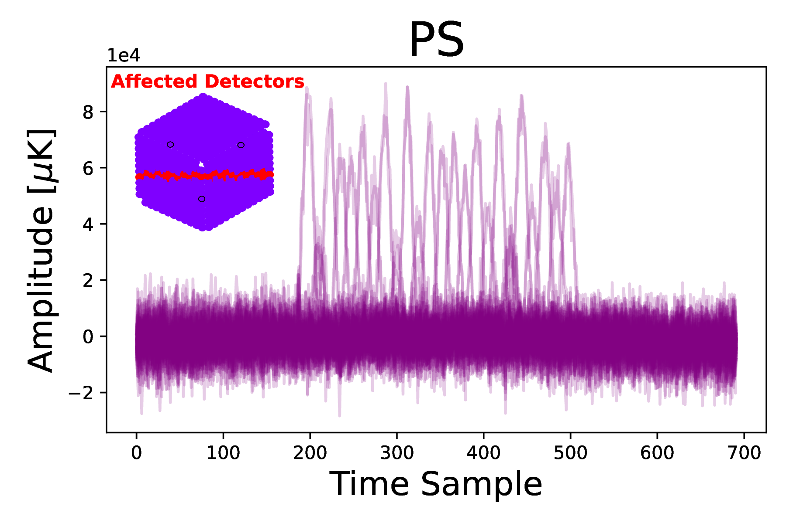
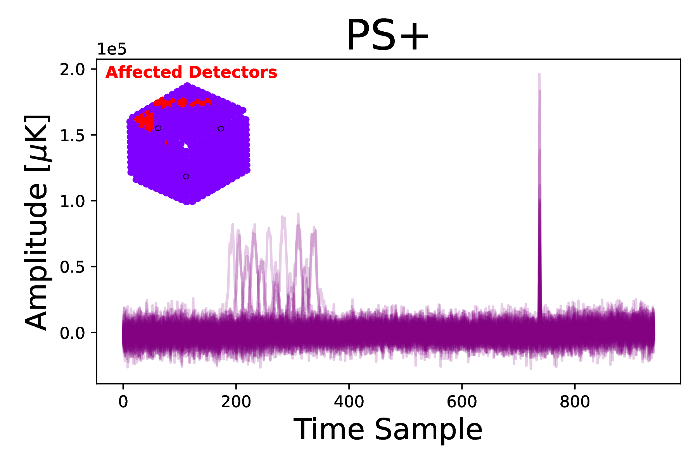
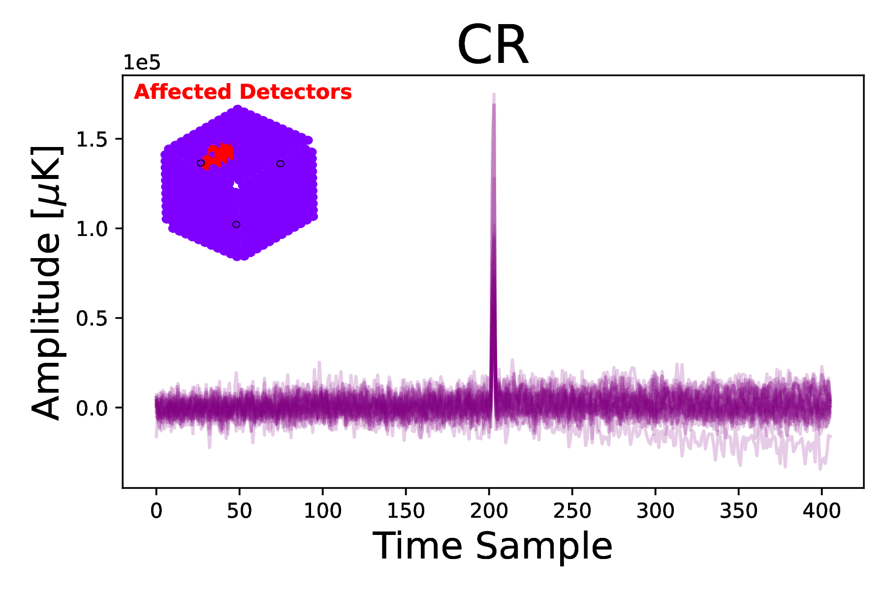
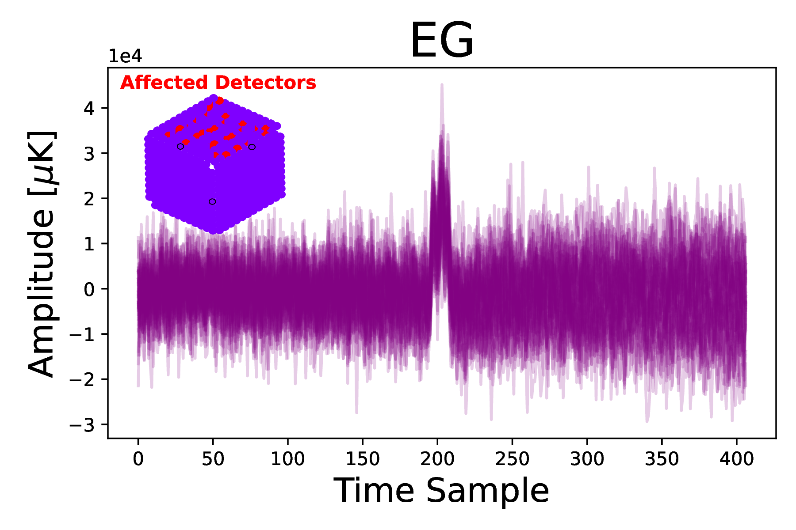
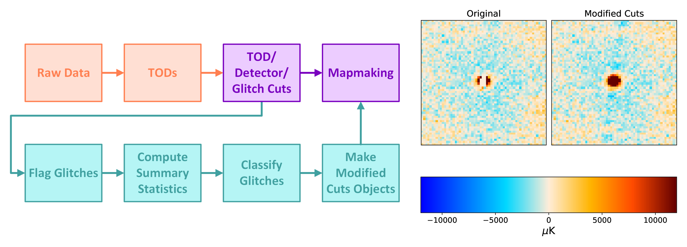

## Example code for the glitch classification pipeline outlined in [Nerval et al. (2025, 2503.10798)](https://arxiv.org/abs/2503.10798) for time-ordered data (TODs) with injected simulated transient sources.

## Description of work:

In the ACT survey, the data timestreams of all detectors are packaged into files known as "time-ordered data streams" (TODs), each containing roughly 11 minutes worth of data. Using knowledge of the telescope pointing, which is recorded during data collection, the TODs are later processed into microwave sky maps using maximum likelihood map-making. The mapmaker is specifically vulnerable to biases from short, high-amplitude, non-Gaussian data bursts in the TOD, and therefore depends on these bursts being excised from the TOD before map-making. Such transient events can be caused by sporadic pathologies from the electronic readout system, cosmic rays, electromagnetic interference, radio frequency interference modulated by telescope motion, ionizing radiation, digitization artifacts, etc. Cosmic rays, for example, sometimes produce rapid spikes in the TODs of single detectors and may sometimes also warm up a region of the detector polarization array near the impact, thereby inducing a signal spike in multiple detectors. We refer to all of these transient phenomena as "glitches".

Bright astrophysical point sources can also cause high-amplitude, non-Gaussian spikes in the TOD and may be mistaken for a glitch. This may be avoided if the coordinate of the source is known before pre-processing. However, this also means that any point source or astrophysical transient that is not already known in advance of map-making can be removed from the data set entirely. It is therefore imperative when pre-processing TODs from CMB telescopes to excise as many glitches as possible while still retaining as many true astrophysical transients as feasible. Figure 1 shows the four categories we define in this work to generally summarize the phenomena we see in the glitches for classification: point sources (PS), point sources with another coincident glitch (abbreviated as PS+), cosmic rays (CR), and electronic glitches (EG). In the figure, the example snippet for the PS+ contains a point source together with a cosmic ray. There is a large variety of electronic glitches that are observed in our data (all labeled as EG): for instance, in the EG panel of Figure 1, a diagonal 'striping" is seen on the focal plane. These detectors share a common read-out line in the time-domain multiplexed system of our multi-channel electronics read-out system.

  
  
  
  
   
  <strong>Figure 1:</strong> <em> The four categories we use in our classifications. From top to bottom we show example detrended TODs for a point source (PS), a point source with another coincident glitch (which is a cosmic ray in this case, labeled as PS+), a cosmic ray (CR), and an electronic glitch (EG). We show the timestreams for all affected detectors, along with the focal plane diagrams in the upper left of each panel, which show the affected detectors in red.</em>

In the [Nerval et al. (2025, 2503.10798)](https://arxiv.org/abs/2503.10798) paper, we present a the first algorithm to differentiate between electronic noise, cosmic rays, and point sources, enabling the removal of undesired signals while retaining true astrophysical signals during TOD pre-processing. Our algorithm utilizes machine learning to classifying these glitches, using statistics that summarize the focal plane layout and TODs of the glitches as features of a random forest. Any source that is found at with high probability (>70%) is then removed from the cuts objects prior to mapmaking. 

  
   
  <strong>Figure 2:</strong> <em> Left: Flow chart showing how the ACT pipeline goes from raw data to maps. The portions we have modified are shown in purple, and the new glitch classification pipeline is shown in teal. Right: Half-degree cut-outs of ACT depth-1 maps with a simulated source with an amplitude of 12,000mJy and a 5000s half-life. The original depth-1 map made with ACT standard cuts algorithm can be seen in the left panel. The same depth-1 map but with features identified by the random forest to be a PS with high-probability (>70%) included can be seen in the right panel. Note that the source was almost completely cut out using the original method, which could result in it not being detected during map-based searches, but using our modified pipeline, it was recovered.</em>

## Files Included in the Repo:

> **Note on Dependencies:** The full pipeline relies on [moby2](https://phy-act1.princeton.edu/public/software/moby2/) and cutslib (private ACT repo). However, the 'ACT_DR6_detector_glitch_classification.ipynb' notebook uses a simplified version, [moby2_lite](https://github.com/guanyilun/moby2_light), which combines some features of moby2 and cutslib to be able to run the example notebook.

- **ACT_DR6_detector_glitch_classification.ipynb:** Example notebook explaining more about how the cuts pipeline works, this can also be found [here](https://github.com/ACTCollaboration/DR6_Notebooks/blob/main/ACT_DR6_detector_glitch_classification.ipynb).
- **filter_stats_functions.py:** Functions used to compute the summary statistics per glitch.
- **sims_compute_filtering_values.py:** Code used to compute the summary stats and make a dataframe with the glitches.
- **Training_and_classification_functions.py:** Functions used to train the random forest and classify glitches.
- **Forest_and_classify.py:** Code used to classify glitches.
- **making_cuts_objects.py:** Code used to make modified cuts objects for mapmaking.
- **depth_1_for_sims.py:** This code is written by Sigurd Naess with only minor modifications by Simran Nerval to work with sims. It is only included in the repo for completeness as it is needed to run the pipeline.
- **run_full_pipeline_forsims.sh:** Example script for how to run the whole glitch detection, glitch classification, and depth-1 (or single scan) mapmaking pipeline.
